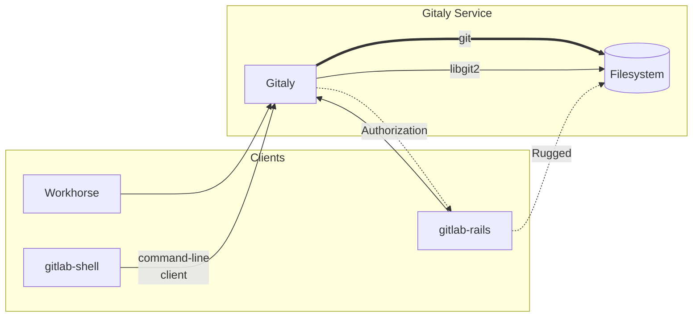
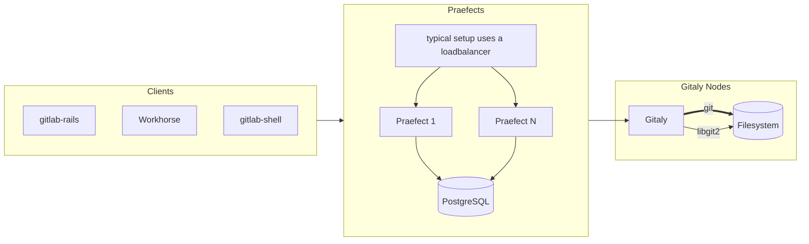

# 

**Quick Links**:
  [**Roadmap**][roadmap] |
  [Want to Contribute?](#contributing) |

Gitaly is a Git [RPC](https://en.wikipedia.org/wiki/Remote_procedure_call)
service for handling all the Git calls made by GitLab.

To see where it fits in please look at [GitLab's architecture](https://docs.gitlab.com/ce/development/architecture.html#system-layout).

## Project Goals

Fault-tolerant horizontal scaling of Git storage in GitLab, and particularly, on [GitLab.com](https://gitlab.com).

## Current Status

Almost all application code accesses Git repositories via Gitaly (with the exception of Rugged which we're working on removing).

Besides "Git over RPC" functionality, Gitaly also offers an optional [high-availability solution](#high-availability).

We are building features according to our [roadmap][roadmap].

## Installation

Most users won't install Gitaly on its own. It is already included in [your GitLab installation](https://about.gitlab.com/install/).

Gitaly requires Go 1.19 or Go 1.20. Run `make` to compile the executables required by Gitaly.

Gitaly uses `git`. Versions `2.41.0` and newer are supported.

## Configuration

The administration and reference guide is [documented in the GitLab project](https://docs.gitlab.com/ee/administration/gitaly/).

## Contributing

See [CONTRIBUTING.md](CONTRIBUTING.md) and a [list of quick win issues](https://gitlab.com/gitlab-org/gitaly/-/issues/?sort=due_date&state=opened&label_name%5B%5D=quick%20win&first_page_size=20).

## Name

Gitaly is a tribute to Git and the town of [Aly](https://en.wikipedia.org/wiki/Aly). Where the town of
Aly has zero inhabitants most of the year we would like to reduce the number of
disk operations to zero for most actions. It doesn't hurt that it sounds like
Italy, the capital of which is [the destination of all roads](https://en.wikipedia.org/wiki/All_roads_lead_to_Rome). All Git actions in
GitLab end up in Gitaly.

## Design

High-level architecture overview:



In [High Availability](#high-availability) mode, the current implementation looks like this (some details omitted):



### Gitaly clients

As of Q4 2018, the following GitLab components act as Gitaly clients:

- [`gitlab`](https://gitlab.com/gitlab-org/gitlab/blob/master/lib/gitlab/gitaly_client.rb):
  the main GitLab Rails application.
- [`gitlab-shell`](https://gitlab.com/gitlab-org/gitlab-shell/tree/main):
  for `git clone`, `git push` etc. via SSH.
- [`gitlab-workhorse`](https://gitlab.com/gitlab-org/gitlab/-/blob/master/workhorse/internal/gitaly/gitaly.go):
  for `git clone` via HTTPS and for slow requests that serve raw Git data.
- [`gitaly-ssh`](https://gitlab.com/gitlab-org/gitaly/tree/master/cmd/gitaly-ssh):
  for internal Git data transfers between Gitaly servers.

The clients written in Go (`gitlab-shell`, `gitlab-workhorse`, `gitaly-ssh`)
use library code from the
[`gitlab.com/gitlab-org/gitaly/client`](https://gitlab.com/gitlab-org/gitaly/tree/master/client)
package.

## High Availability

Gitaly offers a High Availability solution known as Gitaly Cluster ([product documentation](https://docs.gitlab.com/ee/administration/gitaly/)).

- In its current iteration, client traffic goes through [Praefect](https://docs.gitlab.com/ee/administration/gitaly/praefect.html), which then replicates data to multiple Gitaly servers, and stores state in a PostgreSQL database (see [Design](#design) above).
- We are working on a new distributed replication solution referred to as Raft, notably removing the need for Praefect and its database, and offering stricter consistency guarantees. See this [epic](https://gitlab.com/groups/gitlab-org/-/epics/8903) for details on the new design and its progress.

## Further reading

More about the project and its processes is [detailed in the docs](doc/README.md).

## Distributed Tracing

Gitaly supports distributed tracing through [LabKit](https://gitlab.com/gitlab-org/labkit/) using [OpenTracing APIs](https://opentracing.io).

By default, no tracing implementation is linked into the binary, but different OpenTracing providers can be linked in using [build tags](https://golang.org/pkg/go/build/#hdr-Build_Constraints)/[build constraints](https://golang.org/pkg/go/build/#hdr-Build_Constraints). This can be done by setting the `BUILD_TAGS` make variable.

For more details of the supported providers, see LabKit, but as an example, for Jaeger tracing support, include the tags: `BUILD_TAGS="tracer_static tracer_static_jaeger"`.

```shell
make BUILD_TAGS="tracer_static tracer_static_jaeger"
```

Once Gitaly is compiled with an opentracing provider, the tracing configuration is configured via the `GITLAB_TRACING` environment variable.

For example, to configure Jaeger, you could use the following command:

```shell
GITLAB_TRACING=opentracing://jaeger ./gitaly config.toml
```

## Continuous Profiling

Gitaly supports Continuous Profiling through [LabKit][] using [Stackdriver Profiler](https://cloud.google.com/profiler).

For more information on how to set it up, see the [LabKit monitoring docs](https://gitlab.com/gitlab-org/labkit/-/blob/master/monitoring/doc.go).

## Presentations

- [Praefect code walkthrough](https://youtu.be/w2R4ptDLPH4)

  A walkthrough of the Praefect codebase.

- [How to configure backpressure in Gitaly](https://youtu.be/wX9CtFdLYxE)

  An overview of the knobs in the Gitaly config to set limits on incoming traffic.
  There is also [written documentation](doc/backpressure.md).

- [How Gitaly fits into GitLab (Youtube)](https://www.youtube.com/playlist?list=PL05JrBw4t0KqoFUiX42JG7BAc7pipMBAy) - a series of 1-hour training videos for contributors new to GitLab and Gitaly.
  - [Part 1: the Gitaly client in `gitlab-ce`, 2019-02-21](https://www.youtube.com/watch?v=j0HNiKCnLTI&list=PL05JrBw4t0KqoFUiX42JG7BAc7pipMBAy)

    Overview of GitLab backend processes, GitLab Rails deep dive: Gitaly
    config in GitLab Rails, SQL data model, overview of how Gitaly calls get
    made via GitalyClient.call.

  - [Part 2: Git SSH, 2019-02-28](https://www.youtube.com/watch?v=0kY0HPFn25o&list=PL05JrBw4t0KqoFUiX42JG7BAc7pipMBAy)

    What is in a `gitaly-proto` Repository message, legacy vs
    hashed storage (repository directories), `git clone` via SSH,
    `gitlab-shell`, `authorized_keys` and forced commands, what happens
    during `git push`.

  - [Part 3: Git push, 2019-03-07](https://www.youtube.com/watch?v=-kXYycFYDzo&list=PL05JrBw4t0KqoFUiX42JG7BAc7pipMBAy)

    A closer look at the final stage of `git push` where the Git hooks run
    and the refs get updated. Interaction between the Git hooks and GitLab
    internal API. The Git
    [object quarantine mechanism](https://git-scm.com/docs/git-receive-pack#_quarantine_environment).
    Preview of Git HTTP (to be discussed next time).

  - [Part 4: Git HTTP, 2019-03-14](https://www.youtube.com/watch?v=lM13p8lCu8A&list=PL05JrBw4t0KqoFUiX42JG7BAc7pipMBAy)

    Intercepting Git HTTP traffic with mitmproxy, overview of
    Git HTTP clone steps, code walk in `gitlab-workhorse` and `gitlab-ce`,
    investigating internal workhorse API messages used for Git HTTP.

  - [Part 5: Merge Requests across Forks, 2019-03-21](https://www.youtube.com/watch?v=yGSuOz0XOHQ&list=PL05JrBw4t0KqoFUiX42JG7BAc7pipMBAy)

    Fixing a locally broken Ruby gem C
    extension by recompiling, demo of how creating a MR across forks
    causes new commits to suddenly appear in the fork parent repository,
    deep dive into the FetchSourceBranch RPC, adding debug code to see
    how address and authentication metadata is passed down to
    `gitaly-ruby`, failed attempt to log `gitaly-ssh` arguments, comparison
    of `gitaly-ssh` and `gitlab-shell`, a Gitaly server can end up making RPC calls to itself.

  - [Part 6: Creating Git commits on behalf of Git users, 2019-03-21](https://www.youtube.com/watch?v=Rbe0KGTLkxY&list=PL05JrBw4t0KqoFUiX42JG7BAc7pipMBAy)

    Demonstrate how usually Git hooks are run by
    `git-receive-pack`, but sometimes by `gitaly-ruby`. Deep dive into
    UserCommitFiles: where do those hooks actually get run? A look at
    UserMerge. How does Gitaly make merge commits. A look at the
    implementation of the special feature where users are not allowed
    push to a branch, but are allowed to merge into it.

  - [Part 7: How Gitaly uses Prometheus monitoring, 2019-07-09](https://youtu.be/R6F674Nj3wI)

    What is [Prometheus](https://prometheus.io/). Reconstructing a
    [Grafana](https://dashboards.gitlab.net) dashboard panel
    with [PromQL](https://prometheus.io/docs/prometheus/latest/querying/basics/).
    Adding a new counter to Gitaly. Querying Prometheus in Gitaly
    during development. Comparing latency calculation with
    [ELK](https://log.gitlab.net). [GRPC Prometheus
    middleware](https://github.com/grpc-ecosystem/go-grpc-prometheus)
    in Gitaly.

- [TheConf talk on Scaling GitLab Git storage with Gitaly, 2019-08-16](https://speakerdeck.com/olsfer/how-gitlab-scaled-git-access-with-a-go-service)
- [Infrastructure Team Update 2017-05-11](https://about.gitlab.com/2017/05/11/functional-group-updates/#infrastructure-team)
- [Gitaly Basics, 2017-05-01](https://docs.google.com/presentation/d/1cLslUbXVkniOaeJ-r3s5AYF0kQep8VeNfvs0XSGrpA0/edit#slide=id.g1c73db867d_0_0)
- [Git Paris meetup, 2017-02-22](https://docs.google.com/presentation/d/19OZUalFMIDM8WujXrrIyCuVb_oVeaUzpb-UdGThOvAo/edit?usp=sharing) a high-level overview of what our plans are and where we are.

[roadmap]: https://about.gitlab.com/handbook/engineering/development/enablement/systems/gitaly/#roadmap
[LabKit]: https://gitlab.com/gitlab-org/labkit/
