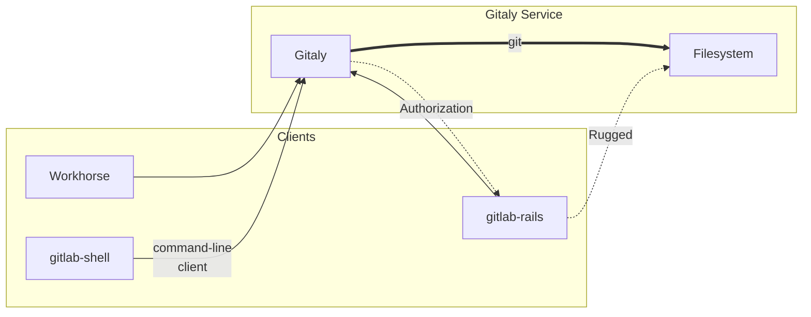
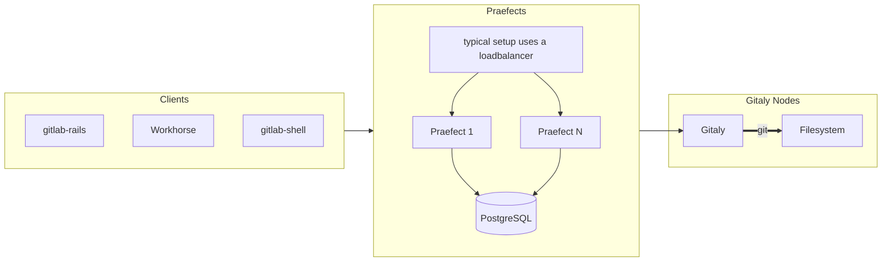

# 

**Quick Links**:
  [**Roadmap**][roadmap] |
  [Want to Contribute?](#contributing) |

Gitaly is a Git [RPC](https://en.wikipedia.org/wiki/Remote_procedure_call)
service for handling all the Git calls made by GitLab.

For documentation generated from the protobuf definitions (in `proto/` directory),
see [Gitaly RPC documentation](https://gitlab-org.gitlab.io/gitaly/).

To see where it fits in please look at [GitLab's architecture](https://docs.gitlab.com/ce/development/architecture.html#system-layout).

## Project Goals

Fault-tolerant horizontal scaling of Git storage in GitLab, and particularly, on [GitLab.com](https://gitlab.com).

## Current Status

Almost all application code accesses Git repositories via Gitaly (with the exception of Rugged which we're working on removing).

Besides "Git over RPC" functionality, Gitaly also offers an optional [high-availability solution](#high-availability).

We are building features according to our [roadmap][roadmap].

## Installation

Most users won't install Gitaly on its own. It is already included in [your GitLab installation](https://about.gitlab.com/install/).

Gitaly requires Go 1.20. Run `make` to compile the executables
required by Gitaly.

Gitaly uses `git`. Versions `2.42.0` and newer are supported.

## Configuration

The administration and reference guide is [documented in the GitLab project](https://docs.gitlab.com/ee/administration/gitaly/).

## Contributing

See [CONTRIBUTING.md](CONTRIBUTING.md) and a [list of quick win issues](https://gitlab.com/gitlab-org/gitaly/-/issues/?sort=due_date&state=opened&label_name%5B%5D=quick%20win&first_page_size=20).

## Name

Gitaly is a tribute to Git and the town of [Aly](https://en.wikipedia.org/wiki/Aly). Where the town of
Aly has zero inhabitants most of the year we would like to reduce the number of
disk operations to zero for most actions. It doesn't hurt that it sounds like
Italy, the capital of which is [the destination of all roads](https://en.wikipedia.org/wiki/All_roads_lead_to_Rome). All Git actions in
GitLab end up in Gitaly.

## Design

High-level architecture overview:



In [High Availability](#high-availability) mode, the current implementation looks like this (some details omitted):



### Gitaly clients

As of Q4 2018, the following GitLab components act as Gitaly clients:

- [`gitlab`](https://gitlab.com/gitlab-org/gitlab/blob/master/lib/gitlab/gitaly_client.rb):
  the main GitLab Rails application.
- [`gitlab-shell`](https://gitlab.com/gitlab-org/gitlab-shell/tree/main):
  for `git clone`, `git push` etc. via SSH.
- [`gitlab-workhorse`](https://gitlab.com/gitlab-org/gitlab/-/blob/master/workhorse/internal/gitaly/gitaly.go):
  for `git clone` via HTTPS and for slow requests that serve raw Git data.
- [`gitaly-ssh`](https://gitlab.com/gitlab-org/gitaly/tree/master/cmd/gitaly-ssh):
  for internal Git data transfers between Gitaly servers.

The clients written in Go (`gitlab-shell`, `gitlab-workhorse`, `gitaly-ssh`)
use library code from the
[`gitlab.com/gitlab-org/gitaly/client`](https://gitlab.com/gitlab-org/gitaly/tree/master/client)
package.

## High Availability

Gitaly offers a High Availability solution known as Gitaly Cluster ([product documentation](https://docs.gitlab.com/ee/administration/gitaly/)).

- In its current iteration, client traffic goes through [Praefect](https://docs.gitlab.com/ee/administration/gitaly/praefect.html), which then replicates data to multiple Gitaly servers, and stores state in a PostgreSQL database (see [Design](#design) above).
- We are working on a new distributed replication solution referred to as Raft, notably removing the need for Praefect and its database, and offering stricter consistency guarantees. See this [epic](https://gitlab.com/groups/gitlab-org/-/epics/8903) for details on the new design and its progress.

## Further reading

More about the project and its processes is [detailed in the docs](doc/README.md).

## Distributed Tracing

Gitaly supports distributed tracing through [LabKit](https://gitlab.com/gitlab-org/labkit/) using [OpenTracing APIs](https://opentracing.io).

By default, no tracing implementation is linked into the binary, but different OpenTracing providers can be linked in using [build tags](https://golang.org/pkg/go/build/#hdr-Build_Constraints)/[build constraints](https://golang.org/pkg/go/build/#hdr-Build_Constraints). This can be done by setting the `BUILD_TAGS` make variable.

For more details of the supported providers, see LabKit, but as an example, for Jaeger tracing support, include the tags: `BUILD_TAGS="tracer_static tracer_static_jaeger"`.

```shell
make BUILD_TAGS="tracer_static tracer_static_jaeger"
```

Once Gitaly is compiled with an opentracing provider, the tracing configuration is configured via the `GITLAB_TRACING` environment variable.

For example, to configure Jaeger, you could use the following command:

```shell
GITLAB_TRACING=opentracing://jaeger ./gitaly config.toml
```

## Continuous Profiling

Gitaly supports Continuous Profiling through [LabKit][] using [Stackdriver Profiler](https://cloud.google.com/profiler).

For more information on how to set it up, see the [LabKit monitoring docs](https://gitlab.com/gitlab-org/labkit/-/blob/master/monitoring/doc.go).

## Training Videos

The [Gitaly Training and Resources Playlist](https://www.youtube.com/playlist?list=PL05JrBw4t0KqPMCB7xW1ExIRp6YuD_7_N)
contains videos that give an overview into how Gitaly works, as well as dive
deep into different parts of Gitaly and even Git.

## Presentations

- [TheConf talk on Scaling GitLab Git storage with Gitaly, 2019-08-16](https://speakerdeck.com/olsfer/how-gitlab-scaled-git-access-with-a-go-service)
- [Infrastructure Team Update 2017-05-11](https://about.gitlab.com/2017/05/11/functional-group-updates/#infrastructure-team)
- [Gitaly Basics, 2017-05-01](https://docs.google.com/presentation/d/1cLslUbXVkniOaeJ-r3s5AYF0kQep8VeNfvs0XSGrpA0/edit#slide=id.g1c73db867d_0_0)
- [Git Paris meetup, 2017-02-22](https://docs.google.com/presentation/d/19OZUalFMIDM8WujXrrIyCuVb_oVeaUzpb-UdGThOvAo/edit?usp=sharing) a high-level overview of what our plans are and where we are.

[roadmap]: https://about.gitlab.com/handbook/engineering/development/enablement/systems/gitaly/#roadmap
[LabKit]: https://gitlab.com/gitlab-org/labkit/
