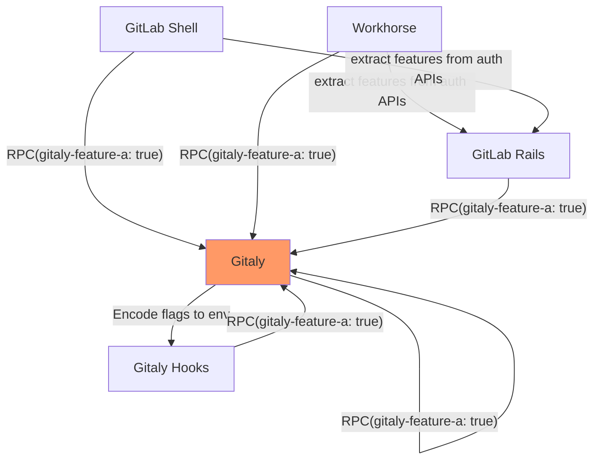
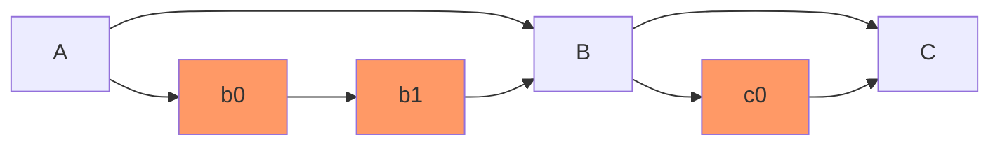
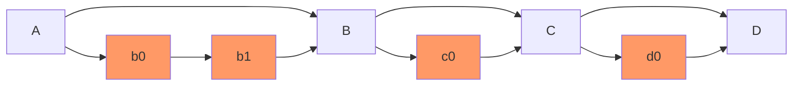
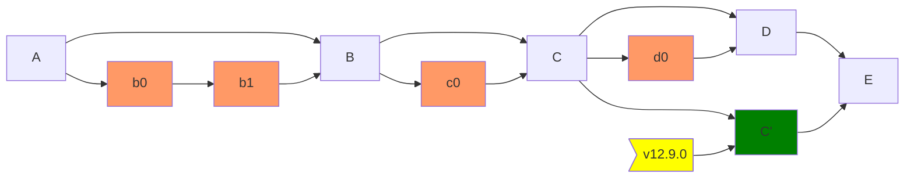
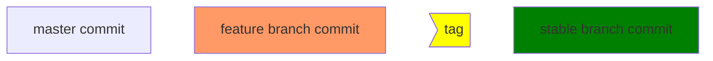

# Gitaly Team Process

## Feature flags

Gitaly uses feature flags to safely roll out features in production. Feature
flags are part of the `context.Context` of each RPC. The `featureflag` package
will help you with flow control.

Most of this documentation assumes operations on `gitlab.com`. For
customers, an [HTTP API is available][ff-api].

In order to roll out feature flags to `gitlab.com`, you should follow
the documented rollout process below.

Once you have [developed your feature][#development-with-feature-flags] you [start
by creating an issue for the rollout][issue-for-feature-rollout].

The "Feature Flag Roll Out" [template for the
issue][feature-issue-template] has a checklist for the rest of the
steps.

[ff-api]: https://docs.gitlab.com/ee/api/features.html#features-flags-api
[issue-for-feature-rollout]: https://gitlab.com/gitlab-org/gitaly/-/issues/new?issuable_template=Feature%20Flag%20Roll%20Out
[feature-issue-template]: https://gitlab.com/gitlab-org/gitaly/-/blob/master/.gitlab/issue_templates/Feature%20Flag%20Roll%20Out.md

### Development with feature flags

It's quite common that a change in Gitaly needs some changes in the clients,
especially GitLab Rails. There is a clear distinction between using feature
flags in GitLab Rails and Gitaly.

#### Feature flags in GitLab Rails

GitLab defines a very clear and strict [workflow for development][rails-feature-development].
Because the flag evaluation is invoked in Rails, we have the flexibility of picking the desired
actors for a feature flag.

[rails-feature-development]: https://docs.gitlab.com/ee/development/feature_flags/index.html

#### Feature flags in Gitaly

Feature flag definitions and their feature gates are
managed by GitLab Rails. Gitaly doesn't have direct access to feature flags.
Instead, Rails is responsible for pre-evaluating feature flags relevant to Gitaly
and propagating the evaluation result to Gitaly through gRPC metadata. Other Gitaly
consumers, such as GitLab Shell or Workhorse, follow the same mechanism. They
propagate the flag evaluation extracted from responses of internal authentication APIs.

After Gitaly receives the flags, it continues to pass feature flags between its
internal components using either:

- Environment variables.
- Its gRPC calls.



> WARNING: This architecture imposes some limitations on how Gitaly uses feature flags
> - All Gitaly feature flags must start with the `gitaly_` prefix. Otherwise, they are
>   not propagated to Gitaly. This prefix is stripped when used in Gitaly internally.
> - Feature flags are not available if an operation does not contact Rails. It
>   means Gitaly background jobs, such as repository maintenance, cannot use feature flags.
feature flags.

To check feature flags in the source code, that flag must be defined in
[internal/metadatta/featureflag][gitaly-featureflag-folder] folder. For example:

```go
package featureflag

// GoFindLicense enables Go implementation of FindLicense
var GoFindLicense = NewFeatureFlag(
	// Snake-cased name of the flag. This is the name used to control the flag
	// via chatops or admin API. The `gitaly_` prefix is stripped.
	"go_find_license",
	// Target version of the flag
	"v14.3.0",
	// Rollout Issue
	"https://gitlab.com/gitlab-org/gitaly/-/issues/3759",
	// Default value
	false,
)
```

The flag definition is exported and used to evaluate the flag. The evaluation
is then extracted from the context (essentially the gRPC context). One important note
here. As feature flags may be turned on/off randomly, the code should work well
in both states. The flag should not introduce one-way data transformation that
makes it impossible to switch back. In addition, Gitaly should be backward-compatible
with the consumers regardless of the current flag state.

```go
func (s *server) FindLicense(ctx context.Context, req *gitalypb.FindLicenseRequest) (*gitalypb.FindLicenseResponse, error) {
	// Blah blah
	if featureflag.GoFindLicense.IsEnabled(ctx) {
    }
}
```

In the test suite, it's recommended to use the [NewFeatureSets][test-featureset] helper.
This helper repeats the test twice for each on/off state of the flag.

```go
func TestSuccessfulFindLicenseRequest(t *testing.T) {
    testhelper.NewFeatureSets(featureflag.GoFindLicense).Run(t, func (t *testing.T, ctx context.Context) {
        if featureflag.GoFindLicense.IsEnabled(ctx) {
            // Test the enabled case
        } else {
            // Test the disabled case
        }
    })
}
```

After the code associated with the flag is deployed, we now can turn on the flag
using chatops. Please note the `gitaly_` prefix. The rollout process is described
in detail in the following sections.

```shell
/chatops run feature set gitaly_go_find_license true --staging
```

[gitaly-featureflag-folder]: https://gitlab.com/gitlab-org/gitaly/-/tree/master/internal/metadata/featureflag
[test-featureset]: https://gitlab.com/gitlab-org/gitaly/blob/c6fb49b9c6e854c0a2803f53106af501d6006cb8/internal/testhelper/featureset.go#L55-55

### Flag management with chatops

Feature flags are [enabled through chatops][enable-flags] (which is
just a consumer [of the API][ff-api]). In
[`#chat-ops-test`][chan-chat-ops-test] try:

```shell
/chatops run feature list --match gitaly_
```

If you get a permission error you need to request access first. That
can be done [in the `#production` channel][production-request-acl].

For Gitaly, you have to prepend `gitaly_` to your feature flag when
enabling or disabling. For example: to check if
[`gitaly_go_user_delete_tag`][chan-production] is enabled on staging
run:

```shell
/chatops run feature get gitaly_go_user_delete_tag --staging
```

[enable-flags]: https://docs.gitlab.com/ee/development/feature_flags/controls.html
[chan-chat-ops-test]: https://gitlab.slack.com/archives/CB2S7NNDP
[production-request-acl]: https://gitlab.slack.com/archives/C101F3796
[chan-production]: https://gitlab.com/gitlab-org/gitaly/-/issues/3371

## Feature flags issue checklist

The rest of this section is help for the individual checklist steps in
[the issue template][feature-issue-template]. If this is your first
time doing this you might want to first skip ahead to the help below,
you'll likely need to file some access requests.

### Feature flag labels

The lifecycle of feature flags is monitored via issue labels.

When the issue is created from a template it'll be created with
[`featureflag::disabled`][featureflag-disabled]. Then as part of the
checklist the person rolling it out will add
[`featureflag::staging`][featureflag-staging] and
[`featureflag::production`][featureflag-production] flags to it.

[featureflag-disabled]: https://gitlab.com/gitlab-org/gitaly/-/issues?label_name[]=featureflag%3A%3Adisabled
[featureflag-staging]: https://gitlab.com/gitlab-org/gitaly/-/issues?label_name[]=featureflag%3A%3Astaging
[featureflag-production]: https://gitlab.com/gitlab-org/gitaly/-/issues?label_name[]=featureflag%3A%3Aproduction

### Is the required code deployed?

A quick way to see if your MR is deployed is to check if [the release
bot][release-bot] has deployed it to staging, canary or production by
checking if the MR has [a `workflow::staging`][deployed-staging],
[`workflow::canary`][deployed-canary] or
[`workflow::production`][deployed-production] label.

The [/help action on GitLab.com][help-action] shows the currently
deployed hash. Copy that `HASH` and look at `GITALY_SERVER_VERSION` in
[`gitlab-org/gitlab.git`][gitlab-git] to see what the embedded Gitaly
version is. Or in [a `gitaly.git` checkout][gitaly-git] run this to see
what commits aren't deployed yet:

```shell
git fetch
git shortlog $(curl -s https://gitlab.com/gitlab-org/gitlab/-/raw/HASH/GITALY_SERVER_VERSION)..origin/master
```

See the [documentation on releases below](#gitaly-releases) for more
details on the tagging and release process.

[release-bot]: https://gitlab.com/gitlab-release-tools-bot
[deployed-staging]: https://gitlab.com/gitlab-org/gitaly/-/merge_requests?state=merged&label_name=workflow%3A%3Aproduction
[deployed-canary]: https://gitlab.com/gitlab-org/gitaly/-/merge_requests?state=merged&label_name=workflow%3A%3Aproduction
[deployed-production]: https://gitlab.com/gitlab-org/gitaly/-/merge_requests?state=merged&label_name=workflow%3A%3Aproduction
[help-action]: https://gitlab.com/help
[gitlab-git]: https://gitlab.com/gitlab-org/gitlab/
[gitaly-git]: https://gitlab.com/gitlab-org/gitaly/

### Enable on staging

#### Prerequisites

You'll need chatops access. See [ChatOps on GitLab.com][chatops-access].

[chatops-access]: https://docs.gitlab.com/ee/development/chatops_on_gitlabcom.html#requesting-access

#### Steps

Run:

`/chatops run feature set gitaly_X true --staging`

Where `X` is the name of your feature.

### Test on staging

#### Prerequisites

Access to <https://staging.gitlab.com/users> is not the same as on
GitLab.com (or signing in with Google on the `@gitlab.com` account). You
must [request access to it][staging-access-request].

As of December 2020 clicking "Sign in" on
<https://about.staging.gitlab.com> will redirect to <https://gitlab.com>,
so make sure to use the `/users` link.

As of writing signing in at [that link][staging-users-link] will land
you on the `/users` 404 page once you're logged in. You should then
typically manually modify the URL
`https://staging.gitlab.com/YOURUSER`
(e.g. <https://staging.gitlab.com/avar>) or another way to get at a test
repository, and manually test from there.

[staging-access-request]: https://gitlab.com/gitlab-com/team-member-epics/access-requests/-/issues/new?issuable_template=Individual_Bulk_Access_Request
[staging-users-link]: https://staging.gitlab.com/users

#### Steps

Manually use the feature in whatever way exercises the code paths
being enabled.

Then enable `X` on staging, run the following in the `#staging` Slack channel:

```shell
/chatops run feature set gitaly_X --staging
```

#### Discussion

It's a good idea to run the feature for a full day on staging, this is
because there are daily smoke tests that run daily in that
environment. These are handled by
[`gitlab-org/gitlab-qa.git`][gitlab-qa-git]

[gitlab-qa-git]: https://gitlab.com/gitlab-org/gitlab-qa#how-do-we-use-it

### Enable in production

#### Prerequisites

Have you waited enough time with the feature running in the staging
environment? Good!

#### Steps

Feature flags must be rolled out in production systems gradually to
reduce risk of incidents. Use percentage rollout instead of enabling a
feature flag fully. The concrete percentages depend on the scope of the feature
flag as well as its inherent risk. In general, add more fine-grained steps the
higher the risk and the broader the scope of the gated feature.

The following chatops commands must run in the `#production` channel.

After the [Improve feature flags in Gitaly][improve-flag-epic] epic is addressed,
Gitaly will support various strategies for us to pick from.

[improve-flag-epic]: https://gitlab.com/groups/gitlab-org/-/epics/8005

#### Rollout to a set of users

It's very common that we want to perform testing on production without affecting
our customers. Gitaly supports enabling a flag for a set of users by running
the following command in chatops channels.

```shell
/chatops run feature set --user=qmnguyen0711,toon gitaly_X
```

After enabling, the flag is turned on for the users listed when performing an
action. One caveat of this strategy is that actions without authentication, such as
cloning a public repository, are not affected.

#### Rollout to a set of repositories

Typically, Git repositories are the main objects that Gitaly takes care of. Nearly
all operations in Gitaly is done inside the scope of Git repositories. Some
repositories have a huge impact on a particular Gitaly node. So, it's natural to
roll out the flags for a set of repositories, typically internal ones.

```shell
/chatops run feature set --repository=gitlab-org/gitlab.git,gitlab-com/www-gitlab-com.git gitaly_X
```

The `--repository` flag supports all repository types, such as Wiki or Snippet.

```shell
/chatops run feature set --repository=snippets/2427310.git gitaly_X
/chatops run feature set --repository=gitlab-org.wiki.git gitaly_X
```

#### Rollout to a set of groups

`gitlab-org` and `gitlab-com` are some of the largest groups on GitLab.com. It also
makes a lot of sense for a feature to be visible to us for verification. Therefore,
to enable a flag for a set of groups, run the following command in chatops channels:

```shell
/chatops run feature set --group=gitlab-org,gitlab-com gitaly_X
```

#### Rollout to a percentage of repositories

To enable your `X` feature at 5/25/50 percentage of repositories, run the following
command in chatops channels.

```shell
/chatops run feature set gitaly_X 5 --actors
/chatops run feature set gitaly_X 25 --actors
/chatops run feature set gitaly_X 50 --actors
```

Due to the pre-evaluation architecture, we could not choose the actor types for
percentage-based rollout. The result of this strategy is persistent between
evaluations of the same repository. That brings the predictability and ease of
debugging if something goes wrong.

#### Rollout to a percentage of time

In some less common cases, we may need a fully-randomized percentage-base rollout.
You need to use `--random` tag in chatops commands:

```shell
/chatops run feature set gitaly_X 5 --random
/chatops run feature set gitaly_X 25 --random
/chatops run feature set gitaly_X 50 --random
```

#### Final steps

And then finally when you're happy it works properly do:

```shell
/chatops run feature set gitaly_X 100
```

Followed by:

```shell
/chatops run feature set gitaly_X true
```

Note that you need both the `100` and `true` as separate commands. See
[the documentation on actor gates][actor-gates]

If the feature is left at `50%` but is also set to `true` by default
the `50%` will win, even if `OnByDefault: true` is [set for
it](#feature-lifecycle-after-it-is-live). It'll only be 100% live once
the feature flag code is deleted. So make sure you don't skip the
`100%` step.

[actor-gates]: https://docs.gitlab.com/ee/development/feature_flags/controls.html#process

#### Discussion

What percentages should you pick and how long should you wait?

It makes sense to be aggressive about getting to 50% and then 100% as
soon as possible.

You should use lower percentages only as a paranoia check to make sure
that it e.g. doesn't spew errors at users unexpectedly at a high rate,
or (e.g. if it invokes a new expensive `git` command) doesn't create
runaway load on our servers.

But say running at 5% for hours after we've already had sufficient
data to demonstrate that we won't be spewing errors or taking down the
site just means you're delaying getting more data to be certain that
it works properly.

Nobody's better off if you wait 10 hours at 1% to get error data you
could have waited 1 hour at 10% to get, or just over 10 minutes with
close monitoring at 50%.

### Feature lifecycle after it is live

#### Discussion

After a feature is running at `100%` for what ever's deemed to be a
safe amount of time we should change it to be `OnByDefault: true`. See
[this MR for an example][example-on-by-default-mr].

We should add a changelog entry when `OnByDefault: true` is flipped.

That should then be followed up by another MR to remove the
pre-feature code from the codebase, and we should add another
changelog entry when doing that.

This is because even after setting `OnByDefault: true` users might
still have opted to disable the new feature. See [the discussion below](#two-phase-ruby-to-go-rollouts) for possibly
needing to do such changes over multiple releases.

#### Two phase Ruby to Go rollouts

Depending on what the feature does it may be bad to remove the `else`
branch where we have the feature disabled at this point. E.g. if it's
a rewrite of Ruby code in Go.

As we deploy the Ruby code might be in the middle of auto-restarting,
so we could remove its code before the Go code has a chance to update
with its default, and would still want to call it. So therefore you
need to do any such removal in two GitLab release cycles.

See the example of [MR !3033][example-on-by-default-mr] and [MR !3056][example-post-go-ruby-code-removal-mr] for how to
do such a two-phase removal.

[example-on-by-default-mr]: https://gitlab.com/gitlab-org/gitaly/-/merge_requests/3033
[example-post-go-ruby-code-removal-mr]: https://gitlab.com/gitlab-org/gitaly/-/merge_requests/3056

#### Remove the feature flag via chatops

After completing the above steps the feature flag should be deleted
from the database of available features via `chatops`.

If you don't do this others will continue to see the features with
e.g.:

```shell
/chatops run feature list --match=gitaly_
```

It also incrementally adds to data that needs to be fetched &
populated on every request.

To remove the flag first sanity check that it's the feature you want,
that it's at [`100%` and is `true`](#enable-in-production):

```shell
/chatops run feature get gitaly_X
```

Then delete it if that's the data you're expecting:

```shell
/chatops run feature delete gitaly_X
```

## Git Version Upgrades

With the introduction of [bundled Git][bundled-git] we have gained the ability
to do feature-flag-based rollouts of new Git versions, and using feature flags
for these upgrades has since then become mandatory.

In the past, upgrades of the Git distribution simply happened in-place, where we
just overwrote existing binaries with a new set of binaries. This has the
potential to cause problems during zero-downtime upgrades: an old Gitaly process
may be expecting a different Git version, or it may end up executing Git in an
environment where some executables are the old version, where some other have
already been replaced with the newer version. Naturally, this can lead to all
kinds of problems.

With the new process we thus do the upgrade in three separate steps to ensure
that we have no such issues with zero-downtime upgrades:

1. We roll out the new bundled Git binaries in parallel to the old bundled
   Git binaries. The new version is guarded behind a feature flag at this
   point in time.

1. We roll out the feature flag and eventually remove it.

1. We remove the old bundled Git binaries.

Note that because we cannot remove the old Git binaries at the same time when we
add the new ones. We must ensure that both sets exist in parallel for at least
one release.

[bundled-git]: git-execution-environments.md#bundled-git-recommended

### Detailed Process

The following detailed steps need to be done to upgrade to a new Git version:

1. Add the new bundled Git distribution to the `Makefile`. See
   c0d05650be681c2accb4cec5aac74a6dd77a2fa6.

1. Add a new bundled Git execution environment with a feature flag. See
   b547b368c8f584e9aabe8eef9342f99440b0c248. Please note that execution
   environments are ordered by decreasing priority: the first environment
   whose feature flags are all turned on will be picked. You thus have to
   add your new environment to the top.

1. Roll out the feature flag by following our feature flag process. You may
   decide to remove the feature flag before the feature flag is removed in
   case it is a low-risk upgrade of the Git version (e.g. when you perform a
   patch-release upgrade, only).

1. Remove the feature flag. See 888e6233fd85691f0852ae6c4a3656da9bf3d8e4.

1. Remove the execution environment of the old bundled Git version. See
   af1a3fe7b536d22a6db9ba6591d222b23d01d83f.

1. Remove the old set of bundled Git binaries from the `Makefile`. See
   9c700ea473d781eea50eab685d643d95e9c4ffee. Note that this must only happen
   _after_ both old and new bundled Git binaries have been installed in
   parallel in a release already.

## Gitaly Releases

Gitaly releases are tagged automatically by
[`release-tools`][release-tools] when a Release Manager tags a GitLab
version.

[release-tools]: https://gitlab.com/gitlab-org/release-tools

### Major or minor releases

Once we release GitLab X.Y.0, we also release Gitaly X.Y.0 based on the content of `GITALY_SERVER_VERSION`.
This version file is automatically updated by `release-tools` during auto-deploy picking.

Because Gitaly master is moving we need to take extra care of what we tag.

Let's imagine a situation like this on `master`



Commit `C` is picked into auto-deploy and the build is successfully deployed to production

We are ready to tag `v12.9.0` but there is a new merge commit, `D`, on Gitaly `master`.



We cannot tag on `D` as it never reached production.

`release-tools` follows this algorithm:

1. create a stable branch from `GITALY_SERVER_VERSION` (commit `C`),
1. bump the version and
1. prepare the changelog (commit `C'`).

Then we tag this commit and we merge back to `master`



Legend



With this solution, the team can autonomously tag any RC they like, but the other releases are handled by the GitLab tagging process.

### Patch releases

The Gitaly team usually works on patch releases in the context of a security release.

The release automation creates the stable branches, tagging the stable branch is automated in `release-tools` as well.
A Gitaly maintainer will only take care of merging the fixes on the stable branch.

For patch releases, we don't merge back to master. But `release-tools` will commit a changelog update to both the patch release, and the master branch.

### Creating a release candidate

Release candidate (RC) can be created with a chatops command.
This is the only type of release that a developer can build autonomously.

When working on a GitLab feature that requires a minimum Gitaly version,
tagging a RC is a good way to make sure the `gitlab` feature branch has the proper Gitaly version.

- Pick the current milestone (i.e. 12.9)
- Pick a release candidate number, you can check `VERSION` to see if we have one already (12.9.0-rc1)
- run `/chatops run gitaly tag 12.9.0-rc1`
- The release will be published
- The [pipeline of a tag](https://gitlab.com/gitlab-org/gitaly/pipelines?scope=tags&page=1)
  has a **manual** job, `update-downstream-server-version`, that will create a merge request on the GitLab codebase to bump the Gitaly server version, and this will be assigned to you.
  Once the build has completed successfully, assign it to a maintainer for review.

## Publishing the Ruby gem

If an updated version of the Ruby proto gem is needed, it can be published to
rubygems.org with the `make publish-proto-gem` Makefile target.

If the changes needed are not yet released, [create a release candidate](#creating-a-release-candidate) first.

- Checkout the tag to publish (vX.Y.Z).
- Run `make publish-proto-gem`, which automatically builds any publishes the
  Protobuf Gem.

## Publishing the go module

If an [updated version](https://golang.org/doc/modules/release-workflow) of the go module is needed, it can be [published](https://golang.org/doc/modules/publishing)
by tag creation.

If a new [major module version update](https://golang.org/doc/modules/major-version) is needed,
it can be changed by running `upgrade-module` `make` task with desired parameters:

```bash
make upgrade-module FROM_MODULE=v15 TO_MODULE=v16
```

It replaces old imports with the new version in the go source files,
updates `*.proto` files and modifies `go.mod` file to use a new target version of the module.

### Security release

Security releases involve additional processes to ensure that recent releases
of GitLab are properly patched while avoiding the leaking of the security
details to the public until appropriate.

Before beginning work on a security fix, open a new Gitaly issue with the template
`Security Release` and follow the instructions at the top of the page for following
the template.

## Experimental builds

Push the release tag to `dev.gitlab.org/gitlab/gitaly`. After
passing the test suite, the tag will automatically be built and
published in <https://packages.gitlab.com/gitlab/unstable>.

## Patching Git

The Gitaly project is the single source of truth for the Git distribution across
all of GitLab: all downstream distributions use the `make git` target to build
and install the Git version used at runtime. Given that there is only one
central location where we define the Git version and its features, this grants
us the possibility to easily apply custom patches to Git.

In order for a custom patch to be accepted into the Gitaly project, it must meet
the high bar of being at least in the upstream's `next` branch. The mechanism is
thus intended as a process to ensure that we can test upstreamed patches faster
than having to wait for the next release, not to add patches which would never
be accepted upstream. Patches which were not upstreamed yet will not be
accepted: at no point in time do we want to start maintaining a friendly fork of
Git.

In order to add a patch, you can simply add it to the `GIT_PATCHES` array in our
`Makefile`.

Note: while there is only a single Git distribution which is distributed across
all of GitLab's official distributions, there may be unofficial ones which use a
different version of Git (most importantly source-based installations). So even
if you add patches to Gitaly's Makefile, you cannot assume that installations
will always have these patches. As a result, all code which makes use of
patched-in features must have fallback code to support the [minimum required Git
version](../README.md#installation)

## RPC deprecation process

First create a deprecation issue at <https://gitlab.com/gitlab-org/gitaly/issues>
with the title `Deprecate RPC FooBar`. Use label `Deprecation`. Below is a
template for the issue description.

```markdown
We are deprecating RPC FooBar because **REASONS**.

- [ ] put a deprecation comment `// DEPRECATED: <ISSUE-LINK>` in ./proto **Merge Request LINK**
- [ ] find all client-side uses of RPC and list below
- [ ] update all client-side uses to no longer use RPC **ADD Merge Request LINKS**
- [ ] wait for a GitLab release in which the RPC is no longer occurring in client side code **LINK TO GITLAB-CE RELEASE TAG**
- [ ] delete the server side implementation of the old RPC in https://gitlab.com/gitlab-org/gitaly **Merge Request LINK**
```
