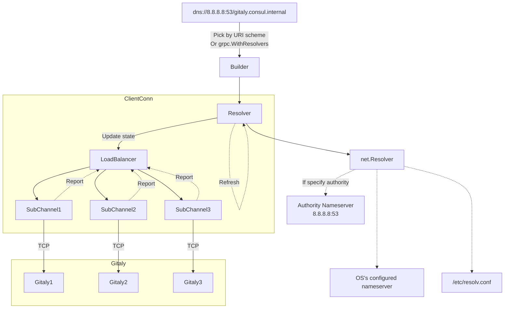

# gRPC load balancing

gRPC protocol is fast protocol built on top of HTTP2. We use gRPC
extensively to act as the main communication between Gitaly and other
services. When Gitaly scaled up, we needed to add more servers and build a smart
proxy (Praefect) to distribute the requests to corresponding nodes.

Essentially, Praefect deploys a collection of servers to avoid being the
bottleneck for the whole Gitaly Cluster. So, it's essential that Praefect
effectively load balance requests.

Like other normal application-layer (L7) protocols, there are two major
approaches:

- Put Praefect servers behind a load balancer. This load balancer can be at L3/L4
  (transport level) or L7 (application level).
- Apply client-side load balancing.

For more information on each approach, see the
[official documentation](https://grpc.io/blog/grpc-load-balancing/).

gRPC supports complete, sophisticated, and flexible client-side load balancing.
However, the official gRPC documentation doesn't cover it. So this documentation
covers how gRPC client-side load balancing works.

## How gRPC client-side load balancing works



Though load balancing is a generic concept, each implementation has some minor
differences and capabilities. This documentation focuses on the `grpc-go`
implementation.

In general, client-side load balancing is managed by
[`grpc.ClientConn`](https://pkg.go.dev/google.golang.org/grpc#ClientConn). When
a client performs `grpc.Dial`, the target URL must be resolved by a resolver. gRPC:

- Supports many built-in resolvers, including a
  [DNS resolver](https://github.com/grpc/grpc-go/blob/master/internal/resolver/dns/dns_resolver.go).
- Provides
  a [powerful framework](https://pkg.go.dev/google.golang.org/grpc/resolver) to
  build a custom resolver. Building client-side load balancing involves three
  main components: builder, resolver, and load balancer.

### Builder

A builder creates a resolver object and handles a particular
scheme (`tcp`, `dns`, `tls`, or any custom scheme). Each `resolver.Builder` is
registered with `resolver.Register` which adds the
builder to global builder map keyed by its
scheme. [`grpc.WithResolvers`](https://pkg.go.dev/google.golang.org/grpc#WithResolvers)
can also be used to locally register a resolver with the connection. The
connection target's scheme is used to select the correct builder to create
a `resolver.Resolver`. Each client connection maintains a single resolver
object.

### Resolver

A resolver is responsible for name resolution and translates a
target (`scheme://host:port`) to a list of IP addresses and port numbers. gRPC
depends on the target scheme to determine the corresponding
resolver. For more information, see
the [relevant documentation](https://github.com/grpc/grpc/blob/master/doc/naming.md).
gRPC libraries support a number of built-in resolvers for most use cases.

The output of the resolver is a list of addresses. After the resolver fetches
the list for the first time or detects any change, it notifies client connection
or channel to create a new load balancer with corresponding subchannels
reflecting the new network topology. This update is handled gracefully so that
the in-flight calls are handled by the old connections until finished. The new
one handles all sequential calls.

#### Passthrough resolver

By default, if the scheme is not specified or unsupported, gRPC falls back
to the `passthrough` resolver, which is the simplest resolver. This resolver
supports both IP address and URL host and always creates a TCP connection
regardless of how many IP addresses resolved from the URL host. The
passthrough resolver doesn't watch for any later IP address changes.

#### DNS resolver

Another popular resolver is the DNS resolver. The target looks something
like `dns:///gitaly.service.dc1.consul` (note three slashes - it's
a [naming convention](https://github.com/grpc/grpc/blob/master/doc/naming.md)).
After starting, this resolver repeatedly issues DNS query requests to DNS
authorities. If it detects any changes, it notifies the client connection to
update network topology.

This resolver always watches for A records. If there is more than one A
record, it fetches the full list. A load balancer is responsible for
distributing the load from this list.

Support for
[SRV records](https://developer.hashicorp.com/consul/docs/discovery/dns#service-lookups)
is deprecated.

#### Other resolvers

gRPC supports other advanced resolvers, such
as [xDS](https://github.com/grpc/grpc/blob/master/doc/grpc_xds_features.md) (
popularized
by [Envoy](https://www.envoyproxy.io/docs/envoy/latest/api-docs/xds_protocol)).
It also let us create a custom resolver to side-load the list of gRPC servers
as we wish. Unfortunately, the support for resolver customization is limited.

### Load balancer

The load balancer is responsible for managing connections and distributing
workloads, and is created from the list of addresses from the resolver. For
each address, the balancer creates a subchannel, which is a TCP connection to a
destination node. Multiple calls to the same node share the same underlying TCP
connection thanks to HTTP2 framing multiplexing. The load balancer constantly
watches the connectivity status of subchannels:

- Subchannels are established asynchronously. The load balancer performs
  initialization promptly to ensure the connection is ready before use.
- When any of the subchannels are disrupted, the load balancer attempts to
  re-connect. After some failed attempts, the load balancer removes the
  subchannel. The sequential requests are redirected to other healthy
  subchannels.
- If the retry policy is set, the load balancer replays the corrupted requests
  to other subchannels automatically. More about this in a later section.
- The load balancer attempts to reconnect the failed node occasionally. When
  the node is back again, the requests are rebalanced to that subchannel again.

Each load balancer implements a strategy for picking the subchannel. By default,
the default load balancer strategy is `pick_first`. This strategy picks the
first address from the resolver and rejects the rest. It creates and maintains a
single subchannel for the first address only.

When the connection is disrupted, the load balancer gives up and lets the upper
layers handle the situation. Even if we use DNS service discovery, all requests
are routed to the first node (likely the first record returned by the DNS
server). The support for client-side load balancing varies between libraries (
for
example, [grpc-go](https://github.com/grpc/grpc-go/tree/09fc1a349826f04420292e0915fd11a5ce3dc347/balancer), [grpc-core](https://github.com/grpc/grpc/blob/7eb99baad858625699071d18f636dff268aa9b45/src/core/plugin_registry/grpc_plugin_registry.cc#L83)).
In general, they support basic load balancing strategies,
especially `round_robin`.

When a client stub issues a call, the load balancer picks a subchannel and
issues a stream. All messages are exchanged in the same stream until completed.

## Configure gRPC load balancing

Use [Service Config](https://github.com/grpc/grpc/blob/master/doc/service_config.md) to
configure client-side load balancing. This approach provides flexibility in controlling
how clients should behave in a cross-platform environment. Multiple load-balancing strategies can
co-exist in the same process.

```go
roundrobinConn, err := grpc.Dial(
	"dns://127.0.0.1:53/grpc.test:50051",
	grpc.WithDefaultServiceConfig(`{
		"loadBalancingConfig": [{"round_robin":{}}],
	}`),
	grpc.WithTransportCredentials(insecure.NewCredentials()),
)
```

In the example above, the target for the gRPC call is set to
`dns://127.0.0.1:53/grpc.test:50051`, where:

- `127.0.0.1:53` is the name server to resolve `grpc.test`. The
  `dns:///grpc.test:50051` part is optional. If not set, Go uses the
  operating systems's DNS.
- `grpc.test` is the service discovery interface.
- `round_robin` is the configured load balancer. It distributes the workload to
  resolved IPs in a round-robin fashion.

## Client retries

While error-handling should be handled by clients, gRPC library does sort of
have automatic error handling. For more information on the different layers of
error handing, see
the [relevant documentation](https://github.com/grpc/proposal/blob/master/A6-client-retries.md#integration-with-service-config).

gRPC is capable of transparent retrying. It means gRPC library handles retrying
automatically without the control of clients. Transparent retrying is done when
gRPC considers the retry is "safe". Some examples of safe retry:

- Transient failure. The failure caused by connectivity changes. For example, a
  subchannel is not contactable before a stub issues a call.
- Requests are written to the wires, but never leave the client.
- Requests reach server, but are not handled by RPC handlers.
- For other RPC failures, the library doesn't retry automatically. Instead, it
  provides a mechanism for us to prompt the retrying process. We can
  configure `retryPolicy` per service and method in the service configuration
  next to load balancing.

The `retryPolicy` depends on returned status codes. Each service and method can
configure the retriable status codes and other parameters.

The following code snippet is an example of how to configure auto-retry.

```go
roundrobinConn, err := grpc.Dial(
	"dns://127.0.0.1:53/grpc.test:50051",
	grpc.WithDefaultServiceConfig(`{
		"loadBalancingConfig": [{"round_robin":{}}],
		"methodConfig": [
			{
				"name": [
					{ "service": "grpc.examples.echo.Echo" }
				],
				"retryPolicy": {
					"maxAttempts": 3,
					"initialBackoff": "0.1s",
					"maxBackoff": "1s",
					"backoffMultiplier": 2,
					"retryableStatusCodes": ["UNAVAILABLE", "CANCELLED", "RESOURCE_EXHAUSTED", "DEADLINE_EXCEEDED"]
				}
			}
		]
	}`), // This sets the initial balancing policy.
	grpc.WithTransportCredentials(insecure.NewCredentials()),
)
```

## Gitaly client-side load balancing

Although gRPC includes a built-in DNS resolver, that resolver has some
significant drawbacks:

- The resolver only resolves the DNS for the first connection. After that, it
  does not update the list of addresses until the client connection triggers it
  actively. The client connection does this only when it detects that some of
  its subchannels are permanently unavailable. Therefore, as soon as the client
  connection is stable, it isn't aware of any new hosts added to the cluster via
  DNS service discovery. This behavior can lead to unexpected stickiness and
  workload skew, especially after a failover.
- A new connection still resolves the DNS again and gets an up-to-date list of
  addresses. Unfortunately, most of Gitaly clients use long-running connections.
  They run multiple calls on the same connections. They barely create new
  connections in normal conditions. Hence, it's unlikely for them to detect DNS
  state changes.
- The support for SRV records is currently in a weird state. This record type is
  only supported when the `grpclb` load balancing strategy is enabled.
  Unfortunately, this strategy is deprecated, and its behavior is not as we
  expected. In the short-term, we would like to use the round-robin strategy. In
  the longer term, we may have a custom strategy for Raft-based clusters.
  Therefore, SRV service discovery is crucial for the future.

In [epic 8971](https://gitlab.com/groups/gitlab-org/-/epics/8971), we added
support for Praefect service discovery:

- We implemented a replacement for default DNS resolver. This resolver
  periodically resolves the DNS for new states. This home-grown resolver helps
  to distribute the workload better and remove skewing situation.
- We use the default round-robin load balancer.

Clients can opt-in to this option
using the [`WithGitalyDNSResolver` dial option](https://gitlab.com/gitlab-org/gitaly/-/blob/220959f0ffc3d01fa448cc2c7b45b082d56690ef/client/dial.go#L91).
All major Gitaly clients already used this option.

## What's next for Gitaly Cluster?

Routing is a crucial aspect of the proposal
in [epic 8903](https://gitlab.com/groups/gitlab-org/-/epics/8903).
The proposal implies we need to implement a smart routing mechanism. Before an
actual RPC is fired, clients have to contact an arbitrary Gitaly node asking for
the responsible node. The built-in load-balancing framework works perfectly in
this case:

- The resolver is responsible for fetching the initial coordinating node. This
  node is responsible for repository-node queries. Occasionally, the resolver
  switches to another node.
- The load balancer finds the actual destination by contacting the coordinating
  node. It maintains all established subchannels, maybe with LRU, to prevent a
  client opens too many connections to Gitaly nodes. The balancer may also set a
  connection to a less-common node to idle state, and wake it up whenever
  needed.

While `grpc-go` can follow this approach, it's not the case for GitLab
Rails. GitLab Rails uses `grpc-ruby` instead of `grpc-core`. This stack doesn't
support custom load balancing implementation. This doesn't mean we are unable to
rebuild this mechanism at a higher layer. In fact, we already did service
discovery and connection management
in [database load balancing](https://gitlab.com/gitlab-org/gitlab/-/tree/92ffb941dcb7d82a71f7bfbcef1059a161e368ac/lib/gitlab/database/load_balancing).
However, there are some downsides:

- Maintenance cost is high. It's highly likely the logic codes are duplicated
  between Go clients and Ruby clients.
- Built-in load-balancing kit hooks deep into the connectivity management at the
  right layer. A side-loaded load balancer at higher layer does not yield the
  same effect.

Therefore, the sidecar smart router is a reasonable solution:

- Gitaly comes with a sidecar proxy.
- Clients establish a dummy connection to this proxy over a single TCP connection.
- This proxy then performs all mentioned smart routing mechanism on the behalf of clients.

This approach comes with plenty of benefits, especially for GitLab Rails. However, there maybe some concerns about the performance.
