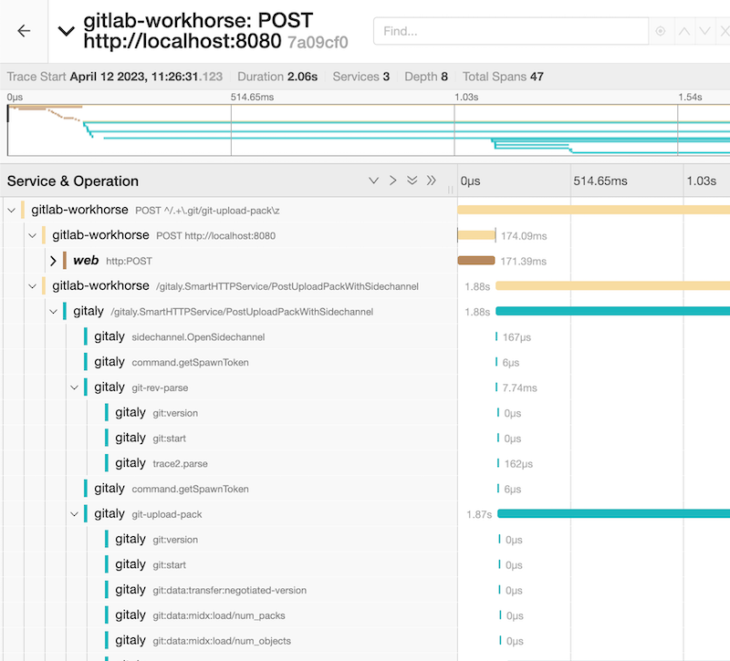
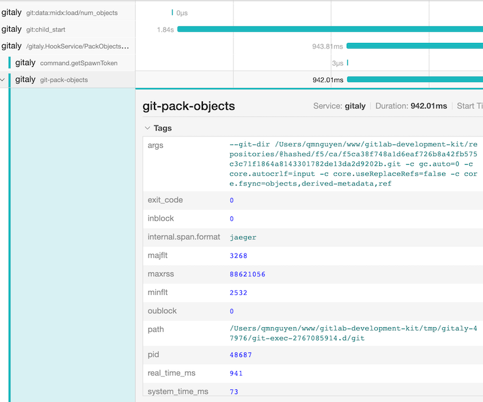

# Using Jaeger for Gitaly local development

Distributed tracing is an essential tool for understanding how services interact
with each other, especially during local development. This tool is very helpful
for tracking a flow of a request from GitLab services (Workhorse, GitLab Shell,
GitLab Rails) to Gitaly and identifying any issues that might be affecting the
performance of your system.

If you're working on local development for Gitaly, you can use Jaeger, a popular
open-source distributed tracing system. Jaeger can:

- Visualize the flow of requests between services and identify any bottlenecks.
- Comprehend data propagation and correlation between them.

When combined with [Trace2](https://git-scm.com/docs/api-trace2), Jaeger can
provide a much deeper look into how Gitaly spawns and manages Git processes.

## Configure Jaeger in local environment

Fortunately, Trace2 and distributed tracing are already enabled in Gitaly by
default. To start tracing, all you need to do is set up Jaeger:

- If you are using the GDK for local development, getting Jaeger setup involves
  some additional configuration to the `gdk.yml` and restarting. You can follow
  [this tutorial](https://docs.gitlab.com/ee/development/distributed_tracing.html#using-jaeger-in-the-gitlab-development-kit)
  for more information.
- Otherwise, you'll need to set up Jaeger manually. You can follow
  [this tutorial](https://docs.gitlab.com/ee/development/distributed_tracing.html#using-jaeger-without-the-gitlab-developer-kit).

## How to use Jaeger for local development

For a video introduction to using Jaeger, see
[Jaeger for Gitaly local development](https://www.youtube.com/watch?v=jJDH4hxmHv4).
The video walks through some common scenarios you might encounter during
development.

The follow section describes a simple scenario. The video has more information
on other view models, as well as more complicated scenarios.

1. When Jaeger starts, go to `http://localhost:16686` to access the Jaeger dashboard.
1. All resulting traces from any actions you perform are captured by Jaeger through
   another endpoint using the `GITLAB_TRACING` environment variable, which is
   set up automatically by GDK. As the traces are collected asynchronously, it
   may take a short moment until the collection is complete.
1. Perform a Git-related action, such as
   `git clone http://localhost:3000/gitlab-org/gitaly.git`.
1. Access the UI dashboard again. The left side includes some filters while the
   right side shows the timeline and corresponding events. Gitaly is not exposed
   directly, so any Remote Procedure Calls (RPCs) originate through entry-point
   components such as Workhorse, GitLab-Shell, and GitLab Rails. You’ll see the
   traces of those services there.
1. Select a trace to enter the trace detail view. The default view displays
   the timeline of spans (events) in chronological order, through multiple
   services. In this example, it shows the details of each `git` command spawned
   by Gitaly.

   

1. Each span consists of detailed data that's very helpful for development
   purposes. Of course, we can add custom instrumentation.

   

One great value distributed tracing offers is the ability to
visualize asynchronous flow in a comprehensive manner. This ability is
particularly helpful for debugging a complicated action flowing through multiple
services in different orders. Unfortunately, this use case is very common.
