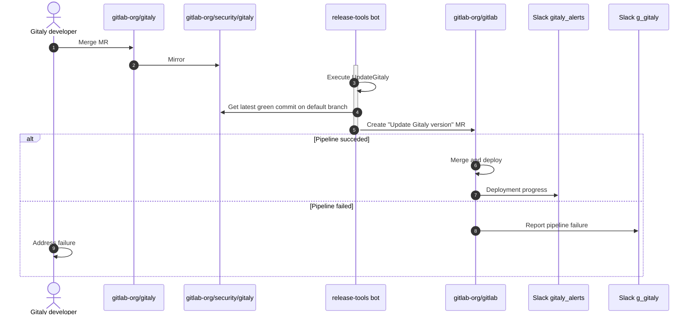

# Release

This document describes how changes to Gitaly are deployed into production on `www.gitlab.com`.

- After two approving reviews, the MR is merged by the second reviewer and is automatically replicated to
  the [`gitlab-org/security/gitaly`](https://gitlab.com/gitlab-org/security/gitaly) mirror (1 and 2).
- Once an hour, the `release-tools` bot executes the [`UpdateGitaly`](https://gitlab.com/gitlab-org/release-tools/-/blob/master/lib/release_tools/tasks/components/update_gitaly.rb)
  task (3).
- `UpdateGitaly` retrieves the latest green commit on the default branch of the mirror and creates an
  MR with the "Update Gitaly version" title on the [`gitlab-org/gitlab`](https://gitlab.com/gitlab-org/gitlab/-/merge_requests)
  repo. The MR updates the `GITALY_SERVER_VERSION` file with the
  [SHA of the latest green commit](https://gitlab.com/gitlab-org/gitlab/-/merge_requests/134951/diffs) (4 and 5).
- The CI pipeline is executed. If the pipeline succeeds, the MR is automatically merged (6) and the
  deployment process (7) to the various [environments](https://gitlab.com/gitlab-org/gitlab/-/environments)
  begins. If the pipeline fails, the failure is reported on the [`#g_gitaly`](https://gitlab.slack.com/archives/C3ER3TQBT)
  channel (8), and the Gitaly team is tagged in the MR. Failures require manual intervention (9).
- Once the deploymnent begins, progress can be tracked in the [`#gitaly_alerts`](https://gitlab.slack.com/archives/C4MU5R2MD)
  channel. The bot also updates the `workflow` labels in the MR as deployment progresses through each stage.

## Why do pipeline failures occur?

The pipeline is unfortunately prone to failure for a variety of reasons:

- Test flake in Gitaly or another component
- A broken master on `gitlab-org/gitlab`
- A regression in Gitaly

### Test flake

If the pipeline failure is suspected to be caused by a flaky test, re-running the pipeline is a good first step to
diagnosing the issue. More often than not, the pipeline will pass in the second run. If the flaky test is within the
Gitlay codebase itself, consider opening an issue based on the [Flaky Test](https://gitlab.com/gitlab-org/gitaly/-/blob/master/.gitlab/issue_templates/Flaky%20Test.md?ref_type=heads)
template and quarantining the test if necessary.

### Broken master

If [master on `gitlab-org/gitlab`](https://gitlab.com/gitlab-org/gitlab) is broken, the best course of action is to wait
for a fix to be merged, and then close the MR. When the `release-tool` bot runs again, it will automatically create a
new MR against the fixed master.

The [`#master-broken`](https://gitlab.slack.com/archives/CR6QH3D7C) channel tracks these failures, and a
[workflow](https://about.gitlab.com/handbook/engineering/workflow/#broken-master) exists for resolving them.

### Regression in Gitaly

If a regression has occurred, the change can either be reverted or a fix can be attempted. It's generally preferred to
revert as it unblocks other inflight changes from being deployed. Once the revert or fix is merged into `gitaly`, close
the MR so the `release-tools` bot can automatically open a new one with the updated `GITALY_SERVER_VERSION`.
Alternatively, you can choose to manually update the `GITALY_SERVER_VERSION` in the existing MR and wait for the
pipeline to pass.
