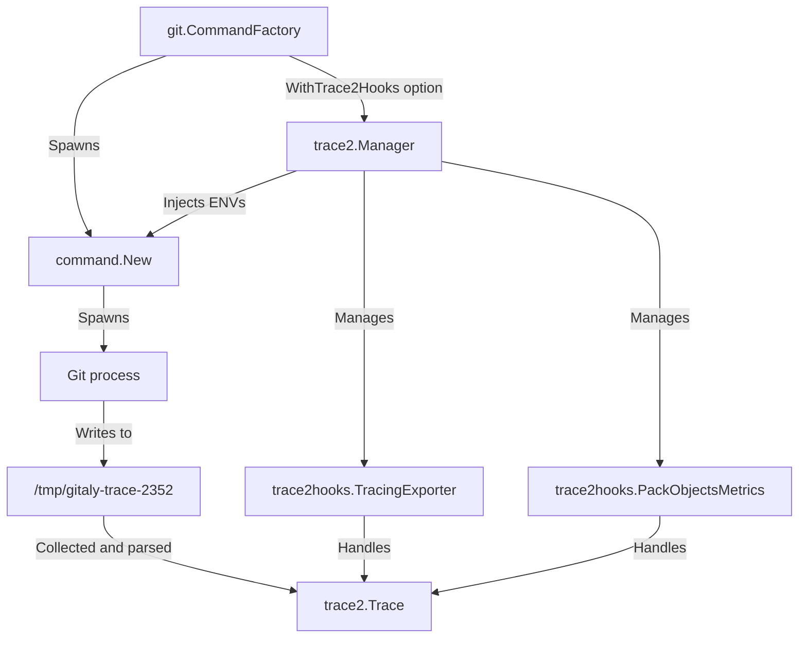
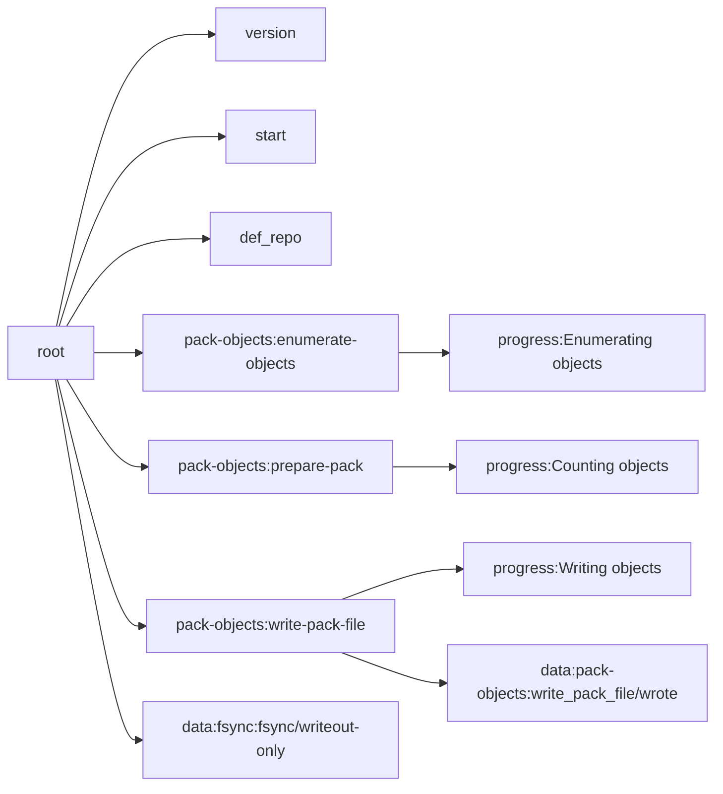

# Trace2 integration

Git includes a tool called [Trace2](https://git-scm.com/docs/api-trace2) that:

- Allows Git processes to display important underlying events and related
  measurements.
- Records child process activities.

However, enabling Trace2 may cause increased overhead for Git processes and could
potentially pose risks when transmitting events between Gitaly and Git processes.
Therefore, you should not enable Trace2 for all Git processes.

Gitaly offers the capability of Trace2 activation on a per subset basis for Git
commands through the use of a "hook" mechanism. This mechanism offers the
advantage of providing more precise monitoring, lowering the risk of potential
hazards previously associated with global Trace2 activation, and reducing
unnecessary overhead.

For a list of available Trace2 hooks, see the
[`trace2hooks`](https://gitlab.com/gitlab-org/gitaly/-/tree/master/internal/git/trace2hooks)
directory in the Gitaly repository. Use this list to carefully select which Git
commands you want to monitor more granularly to increase the command's
visibility without incurring an excessive resource burden.

## How Trace2 is integrated to Gitaly



The overview flow of trace2 integration is demonstrated in the above chart.

Trace2 is enabled by passing some environment variables to spawning Git
processes. For a list of environment variables, see `GIT_TRACE2*` environment
variables on the [documentation page](https://git-scm.com/docs/api-trace2).
We don't set all of them.

Three environment variables enable the Trace2 instrumentation process:

- `GIT_TRACE2_EVENT`. Enables Git export instrumentation data in JSON format.
  Supports dumping the data to `stderr`, to a file, or to a UNIX socket. For
  more information,
  see [Enabling a Target](https://git-scm.com/docs/api-trace2#_enabling_a_target).
- `GIT_TRACE2_PARENT_SID`. Replaces the default auto-generated prefix of
  generated events. We set it to correlation ID from the application context.
- `GIT_TRACE2_BRIEF`. Reduces the amount of output information, such
  as `file`, `line`, and even absolute `time`.

The events are structured as a flat list of events in chronological order. Each
event describes a certain sub operation, including some relative data and
metadata. Some events, such as `"region_enter"` or `"cmd_start,"`, indicate a new
section in which the consecutive events belong. Correspondingly, exiting events,
such as `"region_leave"` or `"atexit,"`, exit the current section.

The following snippet is the resulting events of a `git-pack-objects` command.

```json
{"event":"version","thread":"main","time":"2023-02-22T12:05:04.840009Z", "evt":"3","exe":"2.39.1"}
{"event":"start","thread":"main","t_abs":0.002338,"argv":["git","pack-objects","toon","--compression=0"]}
{"event":"def_repo","thread":"main","repo":1,"worktree":"/gitaly"}
{"event":"cmd_name","thread":"main","name":"pack-objects","hierarchy":"pack-objects"}
{"event":"region_enter","thread":"main","repo":1,"nesting":1,"category":"pack-objects","label":"enumerate-objects"}
{"event":"region_enter","thread":"main","repo":1,"nesting":2,"category":"progress","label":"Enumerating objects"}
{"event":"region_leave","thread":"main","repo":1,"t_rel":0.001083,"nesting":2,"category":"progress","label":"Enumerating objects"}
{"event":"region_leave","thread":"main","line":4490,"repo":1,"t_rel":0.001435,"nesting":1,"category":"pack-objects","label":"enumerate-objects"}
{"event":"region_enter","thread":"main","repo":1,"nesting":1,"category":"pack-objects","label":"prepare-pack"}
{"event":"region_enter","thread":"main","repo":1,"nesting":2,"category":"progress","label":"Counting objects"}
{"event":"region_leave","thread":"main","repo":1,"t_rel":0.000075,"nesting":2,"category":"progress","label":"Counting objects"}
{"event":"region_leave","thread":"main","repo":1,"t_rel":0.000090,"nesting":1,"category":"pack-objects","label":"prepare-pack"}
{"event":"region_enter","thread":"main","repo":1,"nesting":1,"category":"pack-objects","label":"write-pack-file"}
{"event":"region_enter","thread":"main",,"repo":1,"nesting":2,"category":"progress","label":"Writing objects"}
{"event":"region_leave","thread":"main","repo":1,"t_rel":0.003972,"nesting":2,"category":"progress","label":"Writing objects"}
{"event":"data","thread":"main","repo":1,"t_abs":0.008451,"t_rel":0.003996,"nesting":2,"category":"pack-objects","key":"write_pack_file/wrote","value":"1"}
{"event":"region_leave","thread":"main","repo":1,"t_rel":0.004003,"nesting":1,"category":"pack-objects","label":"write-pack-file"}
{"event":"data","thread":"main","repo":1,"t_abs":0.008482,"t_rel":0.008482,"nesting":1,"category":"fsync","key":"fsync/writeout-only","value":"2"}
{"event":"exit","thread":"main","t_abs":0.008489,"code":0}
{"event":"atexit","thread":"main","t_abs":0.008495,"code":0}
```

These events are collected and then parsed into a tree representation in Gitaly.
Each node of the tree represents an event. When the parser
encounters `region_enter` or `child_start` events, it creates a sub-tree containing
the nested nodes.

This tree is stored as a `trace2.Trace` struct. It is passed
into the `Handle(context.Context, *trace2.Trace)` function of `trace2.Hook`.
During development, we can determine its actual structure by either putting a
debugger or printing the structure to console.

Each node contains the following information:

- `Name`: The name of the node, which is a combination of the category and event
  name. For example,`pack-objects:prepare-pack`. Events with a data type have a
  special prefix, such as`data:pack-objects:write_pack_file/wrote`.
- `StartTime` and `FinishTime`: Timestamps indicating when a node starts and
  finishes.
- `Metadata`: Contains interesting metadata extracted from the corresponding
  event. If the node is a data node, the value of the data is accessible
  through `node.Metadata["Metadata"]`.

The above list of events is converted to the following tree:



<details>
<summary>This is an example Go structure of a `git-status` command</summary>

```plaintext
(*trace2.Trace)(0x1400031e2d0)({
 Name: (string) (len=4) "root",
 StartTime: (time.Time) 2023-02-21 08:10:10.668546 +0000 UTC,
 FinishTime: (time.Time) 2023-02-21 08:10:10.687877 +0000 UTC,
 Metadata: (map[string]string) (len=1) {
  (string) (len=4) "code": (string) (len=1) "0"
 },
 Children: ([]*trace2.Trace) (len=13 cap=16) {
  (*trace2.Trace)(0x1400031e360)({
   Name: (string) (len=7) "version",
   StartTime: (time.Time) 2023-02-21 08:10:10.668546 +0000 UTC,
   FinishTime: (time.Time) 2023-02-21 08:10:10.668546 +0000 UTC,
   Metadata: (map[string]string) <nil>,
  }),
  (*trace2.Trace)(0x1400031e3f0)({
   Name: (string) (len=5) "start",
   StartTime: (time.Time) 2023-02-21 08:10:10.668546 +0000 UTC,
   FinishTime: (time.Time) 2023-02-21 08:10:10.668546 +0000 UTC,
   Metadata: (map[string]string) (len=1) {
    (string) (len=4) "argv": (string) (len=10) "git status"
   },
  }),
  (*trace2.Trace)(0x1400031e480)({
   Name: (string) (len=8) "def_repo",
   StartTime: (time.Time) 2023-02-21 08:10:10.668546 +0000 UTC,
   FinishTime: (time.Time) 2023-02-21 08:10:10.668546 +0000 UTC,
   Metadata: (map[string]string) <nil>,
  }),
  (*trace2.Trace)(0x1400031e510)({
   Name: (string) (len=19) "index:do_read_index",
   StartTime: (time.Time) 2023-02-21 08:10:10.668546 +0000 UTC,
   FinishTime: (time.Time) 2023-02-21 08:10:10.668546 +0000 UTC,
   Metadata: (map[string]string) (len=1) {
    (string) (len=3) "msg": (string) (len=10) ".git/index"
   },
   Children: ([]*trace2.Trace) (len=3 cap=4) {
    (*trace2.Trace)(0x1400031e5a0)({
     Name: (string) (len=15) "cache_tree:read",
     StartTime: (time.Time) 2023-02-21 08:10:10.668546 +0000 UTC,
     FinishTime: (time.Time) 2023-02-21 08:10:10.668546 +0000 UTC,
    }),
    (*trace2.Trace)(0x1400031e630)({
     Name: (string) (len=23) "data:index:read/version",
     StartTime: (time.Time) 2023-02-21 08:10:10.668546 +0000 UTC,
     FinishTime: (time.Time) 2023-02-21 08:10:10.668546 +0000 UTC,
     Metadata: (map[string]string) (len=1) {
      (string) (len=4) "data": (string) (len=1) "2"
     },
    }),
    (*trace2.Trace)(0x1400031e750)({
     Name: (string) (len=24) "data:index:read/cache_nr",
     StartTime: (time.Time) 2023-02-21 08:10:10.668546 +0000 UTC,
     FinishTime: (time.Time) 2023-02-21 08:10:10.668546 +0000 UTC,
     Metadata: (map[string]string) (len=1) {
      (string) (len=4) "data": (string) (len=4) "1585"
     },
    })
   },
   Depth: (int) 1
  }),
  (*trace2.Trace)(0x1400031e870)({
   Name: (string) (len=22) "progress:Refresh index",
   StartTime: (time.Time) 2023-02-21 08:10:10.668546 +0000 UTC,
   FinishTime: (time.Time) 2023-02-21 08:10:10.668546 +0000 UTC,
   Children: ([]*trace2.Trace) (len=3 cap=4) {
    (*trace2.Trace)(0x1400031e900)({
     Name: (string) (len=13) "index:preload",
     StartTime: (time.Time) 2023-02-21 08:10:10.668546 +0000 UTC,
     FinishTime: (time.Time) 2023-02-21 08:10:10.668546 +0000 UTC,
    }),
    (*trace2.Trace)(0x1400031e990)({
     Name: (string) (len=13) "index:refresh",
     StartTime: (time.Time) 2023-02-21 08:10:10.668546 +0000 UTC,
     FinishTime: (time.Time) 2023-02-21 08:10:10.668546 +0000 UTC,
    }),
    (*trace2.Trace)(0x1400031ea20)({
    ,
     Name: (string) (len=27) "data:progress:total_objects",
     StartTime: (time.Time) 2023-02-21 08:10:10.668546 +0000 UTC,
     FinishTime: (time.Time) 2023-02-21 08:10:10.668546 +0000 UTC,
     Metadata: (map[string]string) (len=1) {
      (string) (len=4) "data": (string) (len=4) "1585"
     },
    })
   },
  }),
  (*trace2.Trace)(0x1400031eb40)({
   Name: (string) (len=16) "status:worktrees",
   StartTime: (time.Time) 2023-02-21 08:10:10.668546 +0000 UTC,
   FinishTime: (time.Time) 2023-02-21 08:10:10.668546 +0000 UTC,
   Metadata: (map[string]string) <nil>,
   Children: ([]*trace2.Trace) (len=2 cap=2) {
    (*trace2.Trace)(0x1400031ebd0)({
     Name: (string) (len=10) "diff:setup",
     StartTime: (time.Time) 2023-02-21 08:10:10.668546 +0000 UTC,
     FinishTime: (time.Time) 2023-02-21 08:10:10.668546 +0000 UTC,
    }),
    (*trace2.Trace)(0x1400031ec60)({
     Name: (string) (len=24) "diff:write back to queue",
     StartTime: (time.Time) 2023-02-21 08:10:10.668546 +0000 UTC,
     FinishTime: (time.Time) 2023-02-21 08:10:10.668546 +0000 UTC,
    })
   },
  }),
  (*trace2.Trace)(0x1400031ecf0)({
   Name: (string) (len=12) "status:index",
   StartTime: (time.Time) 2023-02-21 08:10:10.668546 +0000 UTC,
   FinishTime: (time.Time) 2023-02-21 08:10:10.668546 +0000 UTC,
   Metadata: (map[string]string) <nil>,
   Children: ([]*trace2.Trace) (len=3 cap=4) {
    (*trace2.Trace)(0x1400031ed80)({
     Name: (string) (len=25) "unpack_trees:unpack_trees",
     StartTime: (time.Time) 2023-02-21 08:10:10.668546 +0000 UTC,
     FinishTime: (time.Time) 2023-02-21 08:10:10.668546 +0000 UTC,
    }),
    (*trace2.Trace)(0x1400031ee10)({
     Name: (string) (len=10) "diff:setup",
     StartTime: (time.Time) 2023-02-21 08:10:10.668546 +0000 UTC,
     FinishTime: (time.Time) 2023-02-21 08:10:10.668546 +0000 UTC,
     Metadata: (map[string]string) <nil>,
    }),
    (*trace2.Trace)(0x1400031eea0)({
     Name: (string) (len=24) "diff:write back to queue",
     StartTime: (time.Time) 2023-02-21 08:10:10.668546 +0000 UTC,
     FinishTime: (time.Time) 2023-02-21 08:10:10.668546 +0000 UTC,
    })
   },
  }),
  (*trace2.Trace)(0x1400031ef30)({
   Name: (string) (len=16) "status:untracked",
   StartTime: (time.Time) 2023-02-21 08:10:10.668546 +0000 UTC,
   FinishTime: (time.Time) 2023-02-21 08:10:10.668546 +0000 UTC,
   Children: ([]*trace2.Trace) (len=1 cap=1) {
    (*trace2.Trace)(0x1400031efc0)({
     Name: (string) (len=18) "dir:read_directory",
     StartTime: (time.Time) 2023-02-21 08:10:10.668546 +0000 UTC,
     FinishTime: (time.Time) 2023-02-21 08:10:10.668546 +0000 UTC,
    })
   },
  }),
  (*trace2.Trace)(0x1400031f050)({
   Name: (string) (len=25) "data:status:count/changed",
   StartTime: (time.Time) 2023-02-21 08:10:10.668546 +0000 UTC,
   FinishTime: (time.Time) 2023-02-21 08:10:10.668546 +0000 UTC,
   Metadata: (map[string]string) (len=1) {
    (string) (len=4) "data": (string) (len=1) "0"
   },
  }),
  (*trace2.Trace)(0x1400031f170)({
   Name: (string) (len=27) "data:status:count/untracked",
   StartTime: (time.Time) 2023-02-21 08:10:10.668546 +0000 UTC,
   FinishTime: (time.Time) 2023-02-21 08:10:10.668546 +0000 UTC,
   Metadata: (map[string]string) (len=1) {
    (string) (len=4) "data": (string) (len=1) "1"
   },
  }),
  (*trace2.Trace)(0x1400031f290)({
   Name: (string) (len=25) "data:status:count/ignored",
   StartTime: (time.Time) 2023-02-21 08:10:10.668546 +0000 UTC,
   FinishTime: (time.Time) 2023-02-21 08:10:10.668546 +0000 UTC,
   Metadata: (map[string]string) (len=1) {
    (string) (len=4) "data": (string) (len=1) "0"
   },
  }),
  (*trace2.Trace)(0x1400031f3b0)({
   Name: (string) (len=12) "status:print",
   StartTime: (time.Time) 2023-02-21 08:10:10.668546 +0000 UTC,
   FinishTime: (time.Time) 2023-02-21 08:10:10.668546 +0000 UTC,
   Metadata: (map[string]string) <nil>,
  }),
  (*trace2.Trace)(0x1400031f440)({
   Name: (string) (len=35) "data_json:traverse_trees:statistics",
   StartTime: (time.Time) 2023-02-21 08:10:10.668546 +0000 UTC,
   FinishTime: (time.Time) 2023-02-21 08:10:10.668546 +0000 UTC,
   Metadata: (map[string]string) (len=1) {
    (string) (len=4) "data": (string) (len=55) "{\"traverse_trees_count\":1,\"traverse_trees_max_depth\":1}"
   },
  })
 },
}
```

</details>

More information about this can be found in the next section.

## How to use the data

As mentioned above, we have implemented a form of "hooks" into the tree. Each
hook implements
the [`trace2.Hook`](https://gitlab.com/gitlab-org/gitaly/-/blob/d15b9c84faee3eb178e7c7d9360832f26d4107a2/internal/git/trace2/hook.go#L6-6)
interface, which enables the hook to walk the tree, filter the corresponding
node, and extract interesting information. Here are the draft implementations
that are referenced:

- [Tracing: Have a deeper look into Git process with trace2](https://gitlab.com/gitlab-org/gitaly/-/merge_requests/5441/diffs)
- [Expose internal pack objects metrics with trace2](https://gitlab.com/gitlab-org/gitaly/-/merge_requests/5442/diffs)

Let's now walk through a simple scenario. Assuming that we need to identify why
a simple `git-status` command is slow, the following hook captures two things:

- Time spent reading the index.
- Index information extraction, such as `version` and `cache_nr`.

```go
type gitStatusHook struct{}

func (h *gitStatusHook) Name() string {
  return "git_status_hook"
}

func (h *gitStatusHook) Handle(rootCtx context.Context, trace *trace2.Trace) error {
  trace.Walk(rootCtx, func(ctx context.Context, trace *trace2.Trace) context.Context {
    switch trace.Name {
    case "index:do_read_index":
      fmt.Printf("Duration of reading index: %v", trace.FinishTime.Sub(trace.StartTime))
    case "data:index:read/cache_nr":
      fmt.Printf("Changed: %v", trace.Metadata["data"])
    }
    return ctx
  })
  return nil
}
```

We must also add the hook to the
[default list of Trace2 hooks](https://gitlab.com/gitlab-org/gitaly/-/blob/d15b9c84faee3eb178e7c7d9360832f26d4107a2/internal/git/command_factory.go#L90-99)
to make it effective.

## Custom Trace2 instrumentation

Although Trace comes bundled with numerous events and data, they may not be
sufficient for certain purposes. Fortunately, Trace2 provides a safe framework
that allows for the injection of custom events.
The [Git Trace2 header file](https://github.com/git/git/blob/9857273be005833c71e2d16ba48e193113e12276/trace2.h#L43)
thoroughly describes this framework. You can search for Trace2 usage in
the [Git source code](https://github.com/search?q=repo%3Agit%2Fgit+trace2_data&type=code).

To inject custom events, you must:

1. Add `trace2_*()` function calls to the
   [GitLab fork of Git](https://gitlab.com/gitlab-org/git.git).
1. Follow the release process.

The list of Trace2 functions can be found in the
[`git/trace2.h`](https://github.com/git/git/blob/9857273be005833c71e2d16ba48e193113e12276/trace2.h#L43)
header file. The comments above each function declaration contain additional
information about how to use them.

For example, the following code snippet injects a custom region event and emits
two string data to Git worktree setup.

```c
void setup_work_tree(void)
{
  trace2_region_enter("gitlab-work-tree", "setup", the_repository);

  // Do something
  trace2_data_string("gitlab-work-tree", the_repository, "realpath-path", tmp_original_cwd);
  trace2_data_string("gitlab-work-tree", the_repository, "realpath-failure", strerror(errno));

  // Do something else
  trace2_region_leave("gitlab-work-tree", "setup", the_repository);
}
```

After it's done, the events are automatically collected by following the
convention illustrated in the above section. It's trivial to extract such
information in Gitaly:

```go
switch trace.Name {
    case "gitlab-work-tree:setup":
        fmt.Print(trace.FinishTime.Sub(trace.StartTime).Seconds())
    case "data:gitlab-work-tree:realpath-path":
        fmt.Print(trace.Metadata["data"])
    case "data:gitlab-work-tree:realpath-failure":
        m t.Print(trace.Metadata["data"])
    }
}
```

Because Trace2 is lightweight and well-isolated, it is relatively safe to add
custom events. More importantly, adding custom events does not affect the
core functionality of Git.

Nonetheless, when adding custom events, avoid adding events in a loop or outputting
sensitive data such as file content.
